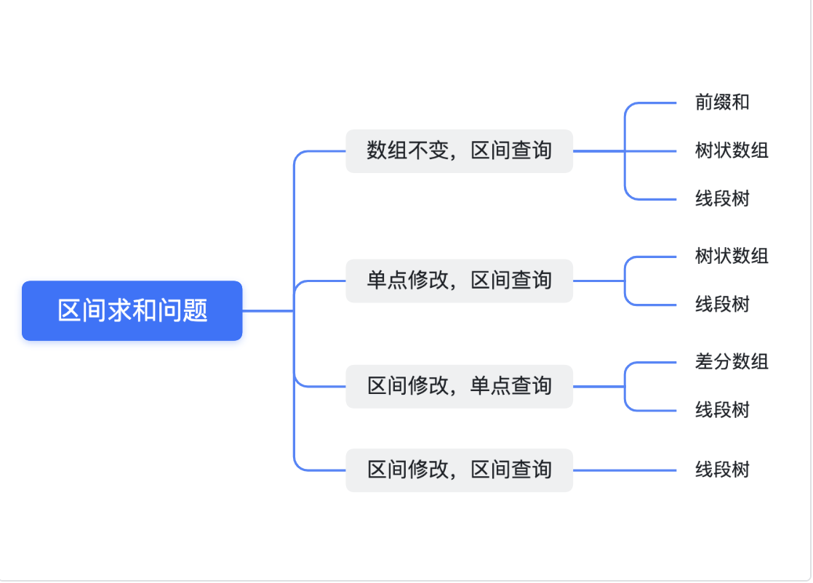

# 区间问题

## QuickView

读者可以自行思考一个问题：对于一个数组 a，如果我想对 a 的进行以下三种操作，在不使用本文数据结构的情况下，暴力算法的时间复杂度为多少：

- 单点修改，区间查询：将第x个元素加k，求出 [x, y] 的区间和。

- 区间修改，单点查询：将 [x, y] 区域内的元素加k，并且求出第$$$$ i (x <= i <= y) $$$$个元素的值。

- 区间修改，区间查询：将 [x1, y1] 区域内的元素加k，并求出 [x2, y2] 的区间和

## 本文介绍数据结构

- 差分数组

- 树状数组

- 线段树

### 差分数组

定义：假设原数组为: ``a = int[]{2,5,7,3,6,9}``，则差分数组b 的每一项为：
$$
b(i)=\left\{ \begin{aligned}  & a[i] - a[i-1], i > 0 \\ & a[0], i=0 \\ \end{aligned} \right.
$$
如下图所示。

| index | 0    | 1    | 2    | 3    | 4    | 5    |
| ----- | ---- | ---- | ---- | ---- | ---- | ---- |
| a[i]  | 2    | 5    | 7    | 3    | 6    | 9    |
| b[i]  | 2    | 3    | 2    | -4   | 3    | 3    |

#### 差分数组的性质

- 性质一：

求原数组中元素 a[i]，相当于求差分数组的前缀和
$$
a[i] = \sum_{j=0}^{i}b[j]
$$


- 性质二：
  -  求原数组中的前缀和：$\sum_{i=0}^{x}a[i] $，代入上式可得：

  - $\sum_{i=0}^{x}a[i] = \sum_{i=0}^{x}\sum_{j=0}^{i}b[j] = \sum_{i=0}^{x} (x-i+1)*b[i] $

  -  关于第二个等号，可以举个例子来说明：

  - 

#### 差分数组的用途

> 区间修改，区间查询

1. 快速处理区间修改操作

区间修改的操作可以分两步执行，例如对于操作给 [x, y] 区间加 K 这个操作：

- b[x] += K

- b[y+1] -= K

1. 快速处理区间查询问题

由性质二，可以在O(n) 的时间范围内查出原数组的前缀和；对于区间 [L, R] 的和为：

$SUM_{L, R} = SUM[R] - SUM[L-1] $

对于区间查询的问题，可以通过进一步地维护一个额外的空间来Trade-Off来压缩时间复杂度，感兴趣的读者可以自行了解。


### 树状数组

树状数组 t[x] 的每一个元素保存了以x为根节点的子树中叶子节点值的和，如下图所示。


**Lowbit 操作**

Lowbit(x): 表示x在二进制位表示下最低位的1及其之后的0构成的数值。如：

```Plain
lowbit(44) = lowbit(0b101100) = (0b100) = 4
```

对于任意一个数 x 来说，它的lowbit值为：``lowbit(x) = x & (-x)``

**性质**

- 在t[x] 数组中，Lowbit(x) 表示了t[x] 覆盖的元素个数。

- t[x - lowbit(x)+1] 为 t[x] 覆盖原数组的第一个元素

- t[x + lowbit(x)] 为 t[x] 在树状数组中的父节点元素

**使用场景**

> 单点修改，区间查询

树状数组对于以下场景的计算具备良好的时间效率：

- **单点修改，区间查询**，例如：修改 a[i]， 查询 $SUM_{L,R} $

反应到树状数组中，主要提供两个API：

```Plain
Ask(x): Return the sum value from 0 to x
Add(x, k): Add k to x
```

对于Ask(x) 操作，从树状数组 t[x] 开始，往树的根节点方向寻找元素并相加，直到最顶层。伪代码如下：

```Go
sum := 0
for i:=x;i>0;i-=lowbit(i) {
    sum += t[i]
}
```

对于Add (x, K) 操作，从树状数组 t[x] 开始，往树的根节点方向寻找元素，并且把寻找到的每个元素值加 K，直到最顶层。

```Go
for i:=x;i<n;i+=lowbit(i){
    t[i] += K
}    
```

### 线段树

**todo**


### 使用场景的总结



### 可能帮助你理解的例子

#### [732. 我的日程安排表 III](https://leetcode.cn/problems/my-calendar-iii/)

#### [1109. 航班预订统计](https://leetcode.cn/problems/corporate-flight-bookings/)

**For More Information:** [SharingSourece](https://leetcode.cn/problems/corporate-flight-bookings/solution/gong-shui-san-xie-yi-ti-shuang-jie-chai-fm1ef/)