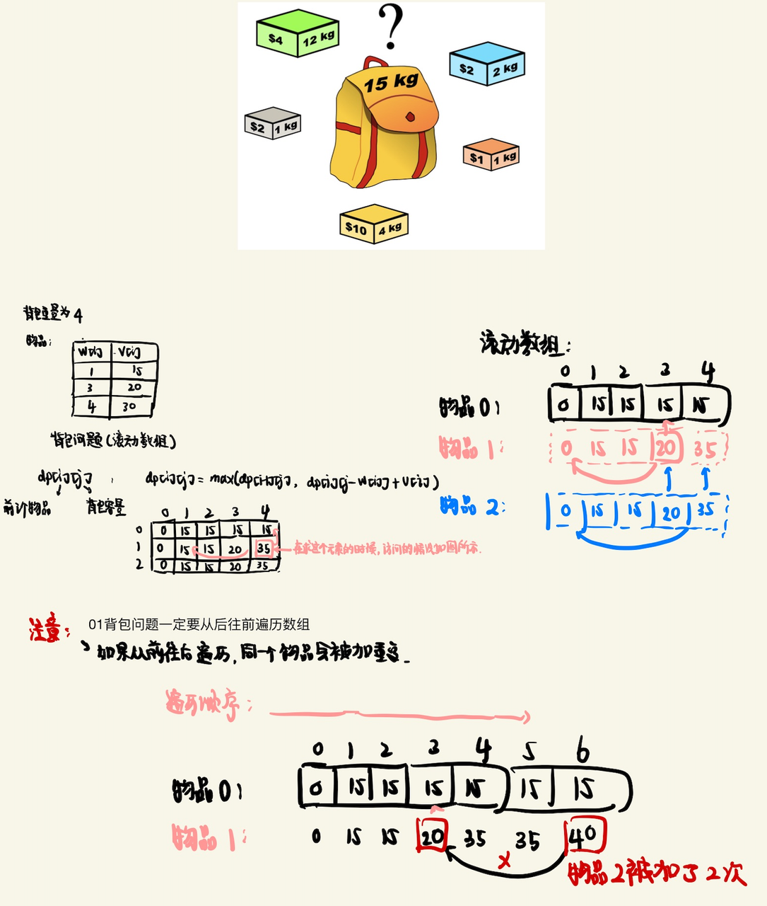

## 01背包问题



### 题目收集

- #### [416. 分割等和子集](https://leetcode.cn/problems/partition-equal-subset-sum/)

  转换为 01-背包问题 × 存在问题：数组中每个元素只能使用一次，判断是否能组成 target = sum / 2。

  View as 01-knapsack problem, the number in the array can be used only once, to see if some of the numbers in the array can sum up to ``sum(nums) / 2``

  ```java
  class Solution {
      public boolean canPartition(int[] nums) {
          int sum = 0;
          for(int i : nums) sum += i;
          if(sum % 2 != 0) return false;
          int target = sum/2;
          // boolean × 01-BP
          boolean[] dp = new boolean[target+1];
          dp[0] = true;
          for(int num : nums){
              for(int i=target;i>=num;i--){
                  dp[i] = dp[i] || dp[i-num];
              }
          }
          return dp[target];
      }
  }
  ```

- #### [1049. 最后一块石头的重量 II](https://leetcode.cn/problems/last-stone-weight-ii/)

  转化为 01-背包问题 × 存在问题，和上一题类似，不同的是需要寻找小于target的最大的位置。

  ```java
  class Solution {
      public int lastStoneWeightII(int[] stones) {
          int sum = 0;
          for(int stone : stones){
              sum += stone;
          }
          int target = sum / 2;
          boolean[] dp = new boolean[target + 1];
          dp[0] = true;
          for(int i=0;i<stones.length;i++){
              for(int j=target; j>=stones[i]; j--){
                  dp[j] = dp[j] || dp[j-stones[i]];
              }
          }
          
          for(int i=target;i>=0;i--){
              if(dp[i]) {
                  return Math.abs(sum - 2*i);
              }
          }
          return 0;
      }
  }
  ```

- #### [494. 目标和](https://leetcode.cn/problems/target-sum/)

  01背包 × 组合问题

  ```java
  ```

  