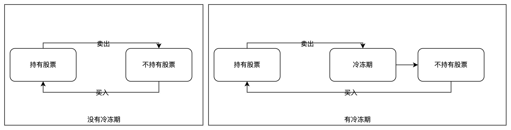

# Stock Series

## [121. 买卖股票的最佳时机](https://leetcode.cn/problems/best-time-to-buy-and-sell-stock/)

```java
class Solution {
    public int maxProfit(int[] prices) {
        int n = prices.length;
        int[] minVal = new int[n];
        int ans = 0;
        for(int i=0;i<n;i++){
            if(i==0){
                minVal[i] = prices[i];
                continue;
            }
            minVal[i] = Math.min(minVal[i-1],prices[i]);
            ans = Math.max(prices[i]-minVal[i], ans);
        }
        return ans;
    }
}
```


## General Stock Probelm Solution



不含冷冻期的情况：

``dp[i][j] `` 表示前i天进行k次买卖能获得的最大收益，第三个维度表示的是持有或者不持有股票的状态，状态转移方程为：

```
dp[i][j][0] = Math.max(dp[i-1][j][0], dp[i-1][j][1] + prices[i]);
dp[i][j][1] = Math.max(dp[i-1][j][1], dp[i-1][j-1][0] - prices[i]);
```

```java
private int generalStockProblem(int[] prices, int k){
  int n = prices.length;
  int[][][] dp = new int[n][k+1][2];
  // init: first day buy or sell
  for(int j=0;j<=k;j++){
    // dp[0][j][0] = 0;
    dp[0][j][1] = -prices[0];
  }
  // DP: process
  int rst = 0;
  for(int i=1;i<n;i++){
    for(int j=1;j<=k;j++){
      dp[i][j][0] = Math.max(dp[i-1][j][0], dp[i-1][j][1] + prices[i]);
      dp[i][j][1] = Math.max(dp[i-1][j][1], dp[i-1][j-1][0] - prices[i]);
      rst = Math.max(Math.max(dp[i][j][0], dp[i][j][1]), rst);
    }
  }
  return rst;
}
```

## [122. 买卖股票的最佳时机 II](https://leetcode.cn/problems/best-time-to-buy-and-sell-stock-ii/)

> 这里可以使用DP，也可以使用贪心。贪心的思路就是：如果卖了能赚，那么能卖就卖，因为不限制购买次数。

```java
class Solution {
    public int maxProfit(int[] prices) {
        int n = prices.length;
        int sum = 0;
        for(int i=1;i<n;i++){
            if(prices[i] > prices[i-1]) sum += prices[i]-prices[i-1];
        }
        return sum;
    }
}
```

如果使用DP，那么久直接套模板：

```java


class Solution {
    public int maxProfit(int[] prices) {
      return generalStockProblem(prices, prices.length);
    }
    private int generalStockProblem(int[] prices, int k){
    int n = prices.length;
    int[][][] dp = new int[n][k+1][2];
    // init: first day buy or sell
    for(int j=0;j<=k;j++){
      // dp[0][j][0] = 0;
      dp[0][j][1] = -prices[0];
    }
    // DP: process
    int rst = 0;
    for(int i=1;i<n;i++){
      for(int j=1;j<=k;j++){
        dp[i][j][0] = Math.max(dp[i-1][j][0], dp[i-1][j][1] + prices[i]);
        dp[i][j][1] = Math.max(dp[i-1][j][1], dp[i-1][j-1][0] - prices[i]);
        rst = Math.max(Math.max(dp[i][j][0], dp[i][j][1]), rst);
      }
    }
    return rst;
  }
}
```

## [123. 买卖股票的最佳时机 III](https://leetcode.cn/problems/best-time-to-buy-and-sell-stock-iii/)

方法一：直接套用DP的模板

```java
class Solution {
    public int maxProfit(int[] prices) {
        return generalStockProblem(prices, 2);
    }

    private int generalStockProblem(int[] prices, int k){
    int n = prices.length;
    int[][][] dp = new int[n][k+1][2];
    // init: first day buy or sell
    for(int j=0;j<=k;j++){
      // dp[0][j][0] = 0;
      dp[0][j][1] = -prices[0];
    }
    // DP: process
    int rst = 0;
    for(int i=1;i<n;i++){
      for(int j=1;j<=k;j++){
        dp[i][j][0] = Math.max(dp[i-1][j][0], dp[i-1][j][1] + prices[i]);
        dp[i][j][1] = Math.max(dp[i-1][j][1], dp[i-1][j-1][0] - prices[i]);
        rst = Math.max(Math.max(dp[i][j][0], dp[i][j][1]), rst);
      }
    }
    return rst;
  }
}
```

优化：使用滚动数组，压缩状态，当K固定为2的时候，相当于使用了四个变量完成了DP遍历的过程。

```java
class Solution {
    public int maxProfit(int[] prices) {
        return generalStockProblem(prices, 2);
    }
    private int generalStockProblem(int[] prices, int k){
    int n = prices.length;
    int[][] dp = new int[k+1][2];
    // init: first day buy or sell
    for(int j=0;j<=k;j++){
      // dp[j][0] = 0;
      dp[j][1] = -prices[0];
    }
    // DP: process
    int rst = 0;
    for(int i=1;i<n;i++){
      for(int j=1;j<=k;j++){
        dp[j][0] = Math.max(dp[j][0], dp[j][1] + prices[i]);
        dp[j][1] = Math.max(dp[j][1], dp[j-1][0] - prices[i]);
        rst = Math.max(Math.max(dp[j][0], dp[j][1]), rst);
      }
    }
    return rst;
  }
}
```